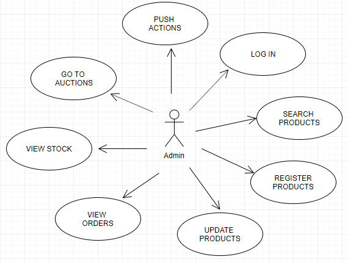
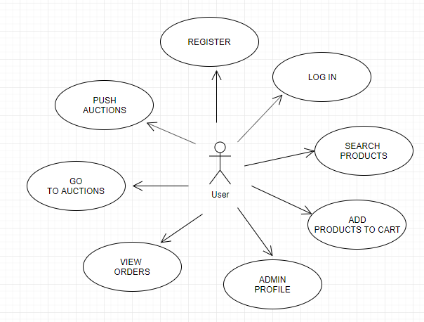
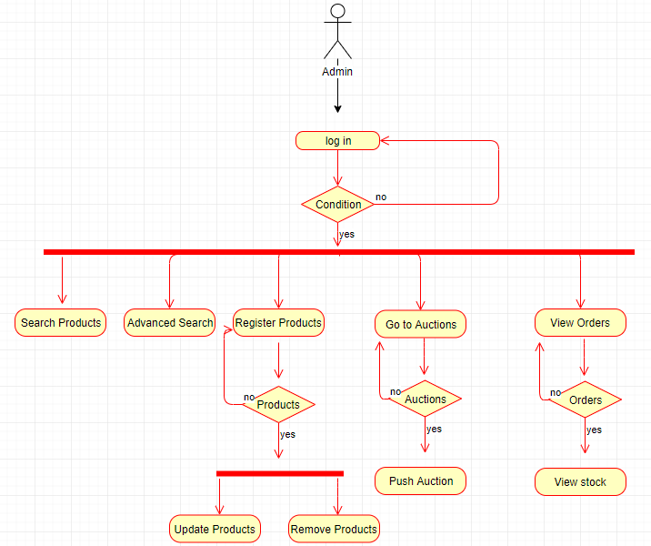
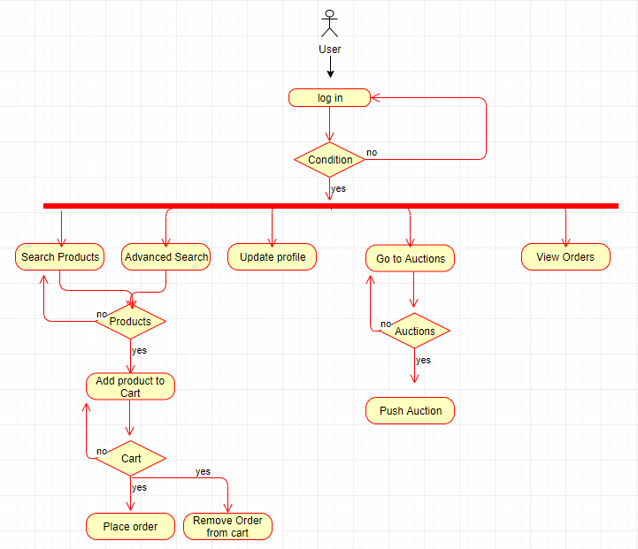
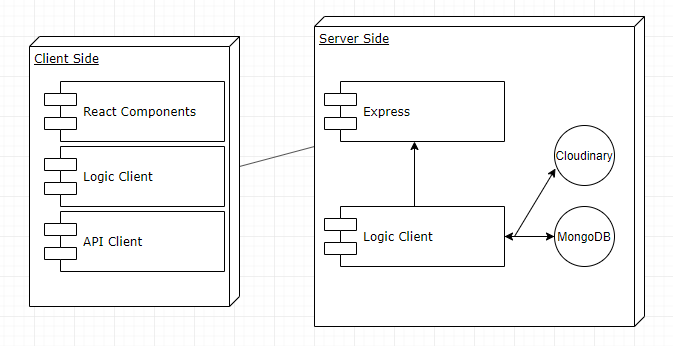
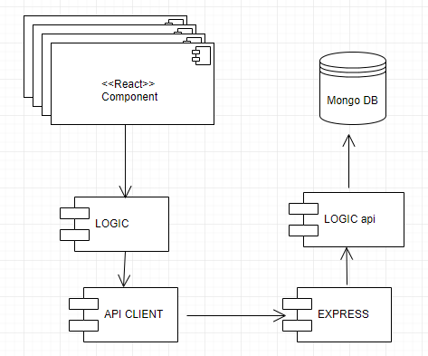
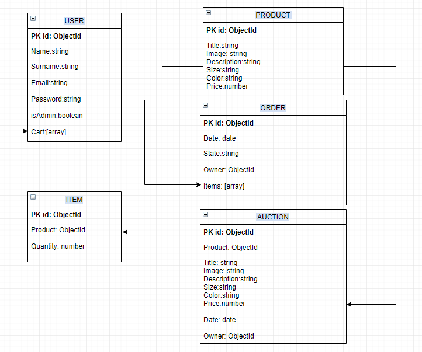
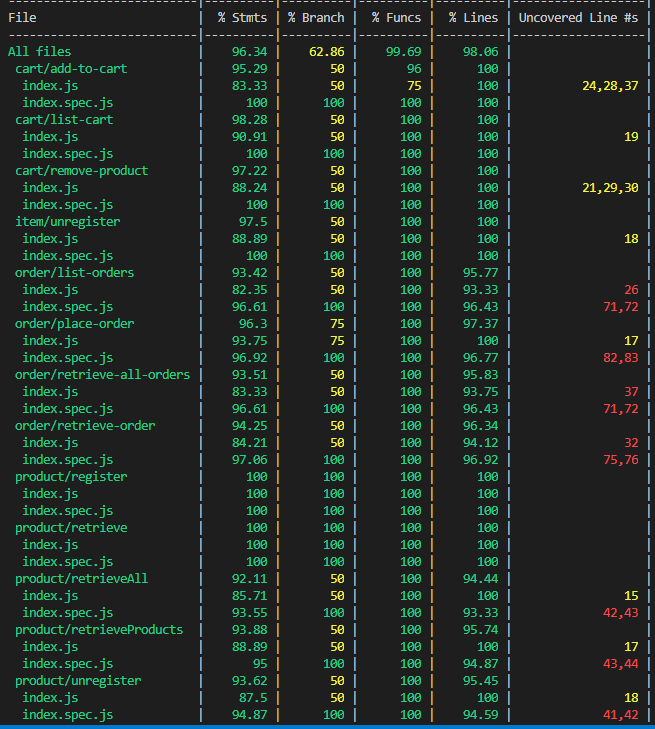

# SKYSHOP

A project by: 
*Albet Fuente*

Link to the project (mobile version): http://skyshop.surge.sh/#/

## INTRODUCTION
The following e-commerce app enables you to search and buy different products from Skylab Coders Acemy.

After registration a user can log in and apart from searching products he can go to the product detail, add the product to the cart and do the checkout.

In the cart section the user can remove items or go directly to the checkout button in order to execute the payment.

Apart from buying products the app also alows you to do auctions.
You can select a product and start an auction which finishes in 24 hours after, the other users can login and push the auction.

## Functional description
Admin can:
* Register, update, remove, search products.
* Check orders, view ordered stock.
* Enter in auctions and push them.

Users can:
* Search products, normal and advanced search.
* Enter in product detail, add product and quantity to cart, go to cart and checkout.
* Enter in auctions and push them.

**USE CASES**

Admin case

User case

**FLOW CHART**

Admin

User

## Technical description

**BLOCK DIAGRAM**

**COMPONENTS**

**DATA MODEL**

**CODE COVERAGE**

**TECHNOLOGIES**

Javascript, ReactJS, Node.js, Express, MongoDB & Mongoose.
